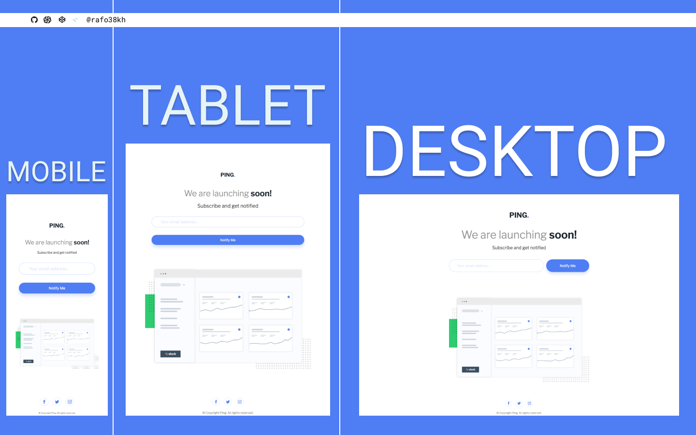

# Frontend Mentor - Ping Coming Soon Page Solution

This is a solution to the [Ping Coming Soon Page Solution Challenge on Frontend Mentor](https://www.frontendmentor.io/challenges/ping-single-column-coming-soon-page-5cadd051fec04111f7b848da)

## Table of contents

- [Overview](#overview)
  - [The challenge](#the-challenge)
  - [Screenshot](#screenshot)
  - [Links](#links)
- [My process](#my-process)
  - [Built with](#built-with)
- [Author](#author)

## Overview

### The challenge

Users should be able to:

- View the optimal layout for the site depending on their device's screen size
- See hover states for all interactive elements on the page
- Submit their email address using an `input` field
- Receive an error message when the `form` is submitted if:
  - The `input` field is empty. The message for this error should say _"Whoops! It looks like you forgot to add your email"_
  - The email address is not formatted correctly (i.e. a correct email address should have this structure: `name@host.tld`). The message for this error should say _"Please provide a valid email address"_

### Screenshot

### Links

- Solution URL: [https://www.frontendmentor.io/solutions/ping-coming-soon-page-with-scss-bem-css-flexbox-and-vanilla-js-QLUZwf8KK](https://www.frontendmentor.io/solutions/ping-coming-soon-page-with-scss-bem-css-flexbox-and-vanilla-js-QLUZwf8KK)
- Live Site URL: [https://rafo38kh.github.io/ping-coming-soon-page/](https://rafo38kh.github.io/ping-coming-soon-page/)

## My process

### Built with

- Semantic HTML5 markup
- SCSS custom properties
- CSS Flexbox
- Vanilla JS
- Mobile-first workflow

## Author

- Frontend Mentor - [@rafo38kh](https://www.frontendmentor.io/profile/rafo38kh)
- GitHub - [@rafo38kh](https://github.com/rafo38kh)
- Codewars - [@rafo38kh](https://www.codewars.com/users/rafo38kh)
